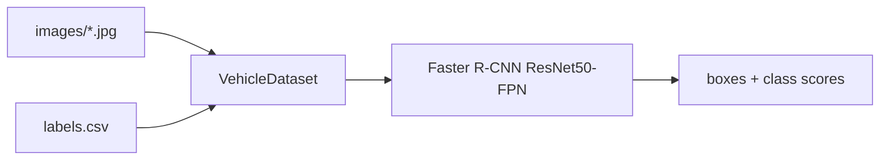

# Autonomous Driving Object Detection

Fine-tunes torchvision's Faster R-CNN ResNet50-FPN in PyTorch to detect and box 11 vehicle and person classes on a labeled still-image set of roughly 5.6k valid frames. A custom `VehicleDataset` reads `labels.csv`, drops boxes with non-positive width or height, skips images that are missing from disk, and hands clean tensors to the detector. The box predictor head is replaced to match the class count, then trained with SGD on a single GPU. Built for the Caltech AI/ML Programming capstone.

## Results

Reported from the training run documented in the previous README. Not re-run here.

| Metric | Value |
| --- | --- |
| Train loss, epoch 1 | 0.4989 |
| Train loss, epoch 2 | 0.4528 |
| Epochs | 2 |
| Valid images | 5,626 |
| Split (train / val / test) | 4,500 / 563 / 563 |
| GPU | NVIDIA GeForce GTX 1650 |

There is no mAP in this repo. No precision or recall either. The script tracks training loss only.

## Architecture



## Classes

Index order comes from `class_to_idx` in the script.

| Index | Class |
| --- | --- |
| 0 | background |
| 1 | pickup_truck |
| 2 | car |
| 3 | articulated_truck |
| 4 | bus |
| 5 | motorized_vehicle |
| 6 | work_van |
| 7 | single_unit_truck |
| 8 | pedestrian |
| 9 | bicycle |
| 10 | non-motorized_vehicle |
| 11 | motorcycle |

## Stack

Python, PyTorch, torchvision, pandas, Pillow, scikit-learn, tqdm.

## Clone

```bash
git clone https://github.com/DannyBarren/Autonomous_Driving_Neural_Net.git
cd Autonomous_Driving_Neural_Net
```

## How to train

```bash
pip install -r requirements.txt
```

1. Open `Barren_Object_Detection_Neural_Network.py`. `IMAGE_DIR` and `output_path` are blank assignments in the committed file. The operator must set both locally: `IMAGE_DIR` to the image folder, `output_path` to the `.pth` destination.
2. Place `labels.csv` and the image folder locally. Neither is in git.
3. Run it.

```bash
python Barren_Object_Detection_Neural_Network.py
```

Training config in the committed script: Resize to (600, 800), ToTensor, batch size 2, SGD with lr 0.005, momentum 0.9, weight decay 0.0005, `num_epochs = 2`.

## Data

Labeled still images. One row per box in `labels.csv`, no header, columns in this order:

```
image_id, class, xmin, ymin, xmax, ymax
```

`image_id` is zero-padded to 8 digits and matched against `<image_id>.jpg` in `IMAGE_DIR`. The dataset is not shipped in this repo.

## Limitations

- 2 epochs. Loss was still falling when training stopped.
- No mAP, precision, or recall. Loss is the only number.
- No images and no weights in git.
- `IMAGE_DIR` and `output_path` are blank in the committed file. The script will not run until they are set.
- Capstone-scale still-image detection. Not a driving stack. No tracking, no sensor fusion, no real-time path.

## What this is evidence of

- Fine-tuning a detection head on a pre-trained backbone.
- Writing a custom PyTorch Detection dataset with the target dict Faster R-CNN expects.
- Box cleaning: degenerate boxes removed globally and again per sample, missing images skipped, empty batches handled by a custom collate.
- A GPU training loop with per-batch loss reporting.
- An honest 80/10/10 split with a fixed seed, and reported numbers that stop where the evidence stops.

## License

MIT. See [LICENSE](LICENSE).
